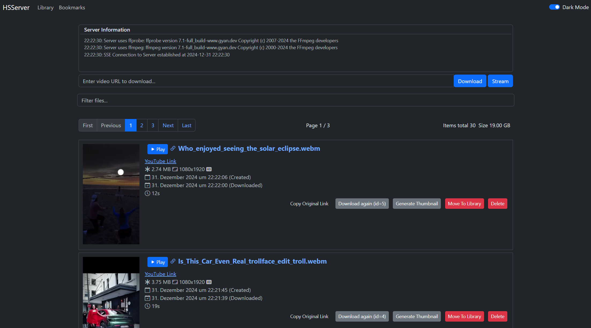

# HereSphere Server

A server to allow HereSphere to view YouTube videos and [any other site supported by yt-dlp](https://github.com/yt-dlp/yt-dlp/blob/master/supportedsites.md). Also supports downloading any viewed videos from yt-dlp supported links or direct video file links.

_Not officially endorsed by or affiliated with HereSphere._

## Installation

- **Windows Users**: Build a Windows executable with the `build_executable.py` script. Follow the instructions below.
- **Mac Users**: Follow the instructions below on running the Python server from source.
- **Linux Users**: Follow the instructions below on running the Python server from source.

### Pre-requirements

You need to have `ffmpeg` and `ffprobe` installed and callable via path.

## User Guide

### Step 1 - Setting the Link Server Address

Start the server. Load the HereSphere web browser and click the cog wheel to open the settings. In the `Link Server` field, enter the URL you were given from the server window.

- For Steam users, this will be the localhost URL: `http://localhost:5000`.
- For Quest users, this will be the LAN IP of your device. The server will attempt to find the LAN IP of your device and present you with a URL.

On server start, you get information on where your server is listening.
_Example LAN IP:_ `http://192.168.x.x:5000`

### Step 2 - Verifying Connectivity

If you visit the link server URL in your browser, you should see an interface that lists all of the videos you have downloaded to the server directory. This list contains direct links and a filter option for easy browsing.

### Step 3 - Streaming & Downloading

You must set the link server address to use the stream or download options provided by HereSphere.

Set the link server in the HereSphere UI to your server and port: `http://<Link Server Address>:5000`.

Internally, the tool uses yt-dlp, so [any site that is supported by yt-dlp](https://github.com/yt-dlp/yt-dlp/blob/master/supportedsites.md) will work for streaming and downloading.

#### Streaming

Inside the internal web browser in HereSphere, go to the video you want to watch. Normally, the place where the browser player wants to start the video.

Click the link server symbol (first icon on the left from the browser URL).

HereSphere will contact the link server with the current URL. The server will figure out the stream URL and send it back to HereSphere for playback.

If all goes right, the video should start playing. If nothing happens, either the link server is not running or misconfigured, or the URL is not supported.

#### Downloading

You can try to download the current playing video by pressing the download button from the HereSphere UI.

By pressing download in the HereSphere UI, the current playing URL is sent to the link server for download in the background.

You can find a link to your downloaded video from the server interface page at `http://<Link Server Address>:5000` or see the progress of the download.


# Running from source

Either download the repository or clone it locally.


```bash
git clone https://github.com/zetaphor/heresphere-server
```

## Setup

This application was developed against Python 3.11.2.

### Virtual Environment Setup

Before installing the dependencies, it's recommended to set up a virtual environment. This isolates your project dependencies from your global Python environment. There are several tools available for this:

#### Using venv (built into Python)

1. Create a virtual environment:

```bash
python3 -m venv .venv
```

2. Activate the virtual environment:

```bash
source .venv/bin/activate
```

#### Using pyenv (great for managing multiple Python versions)

1. Install pyenv, see [pyenv installation instructions](https://github.com/pyenv/pyenv).
2. Install Python 3.11.2 (if not already installed):

```bash
pyenv install 3.11.2
```
3. Create a new virtual environment with Python 3.11.2:

```bash
pyenv virtualenv 3.11.2 .venv
```

4. Activate the virtual environment:

```bash
source .venv/bin/activate
```

### Dependencies

Once your virtual environment is active, install the project dependencies:
```bash
pip install -r requirements.txt
```

Remember to deactivate your virtual environment when you're done:

Using venv or pyenv:
```bash
deactivate
```

## Running

Run the server
```bash
python3 main.py
```


## Building Windows Binary

To build the Windows distributable with PyInstaller:

1. Install PyInstaller:

    ```bash
    pip install pyinstaller
    ```

2. Run the helper script:

    ```bash
    python3 .\build_executable.py
    ```

3. The generated binary and necessary files will be located in the `./dist` folder.


## Server Interface

The server interface is reachable on the URL provided during startup of the server, typically `http://127.0.0.1:5000`.

Here you can Browse and Download videos from the server.

Additionally, the server interface provides:
* Thumbnails with small previews
* Video file information
* Delete downloads
* Move to library (separate folder on the server)
* Server information with current download progress
* And more...

_Example Screenshot_


## Optimized View for HereSphere

HereSphere has its own API and optimized UI for browsing the videos from a server like this one.

By navigating to the server inside the HereSphere browser and pressing the link server icon, the server will provide a special JSON for HereSphere to visualize the files on the server.

The endpoint is `http://127.0.0.1:5000/heresphere`.